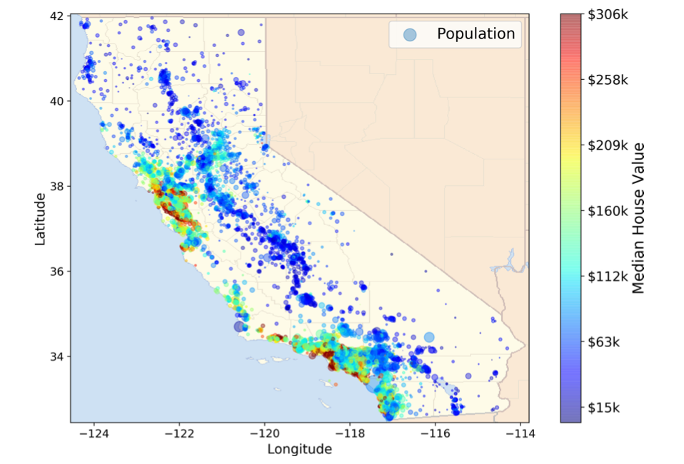

<div align="center">



<h1>California Housing — OLS Assumptions and Model Selection</h1>

<p>
A deep dive into <strong>Ordinary Least Squares (OLS)</strong> applied to the California Housing dataset.  
This project revisits the classical linear modeling framework — exploring its assumptions, diagnostics, and selection criteria —  
to show how far a carefully validated linear model can go without relying on modern black-box methods.
</p>

</div>

<hr>

<table>
  <tr>
    <td><b>Model Family</b></td>
    <td>Ordinary Least Squares (statsmodels)</td>
    <td><b>Dataset</b></td>
    <td>California Housing (sklearn)</td>
  </tr>
  <tr>
    <td><b>Main Topics</b></td>
    <td>Model assumptions, diagnostics, feature transformation</td>
    <td><b>Selection Method</b></td>
    <td>Best Subset Selection with Cross-Validation</td>
  </tr>
</table>

<hr>

<div align="center">
  <a href="#overview">Overview</a> •
  <a href="#goals">Goals</a> •
  <a href="#methodology">Methodology</a> •
  <a href="#results">Results</a> •
  <a href="#diagnostics">Diagnostics</a> •
  <a href="#reproducibility">Reproducibility</a> •
  <a href="#structure">Repo Structure</a>
</div>

<hr>

## Overview

This study revisits the foundations of linear regression through the lens of the 
<em>California Housing</em> dataset.  
The goal is not to compete with complex models but to re-examine what makes OLS statistically valid —  
and to see what happens when its assumptions are met, violated, and corrected through transformations.

We start from the raw dataset, test the baseline OLS, and progressively refine the model by:
- Applying **log transformations** to both predictors and target,
- Testing all possible predictor combinations using **best subset selection**,
- Choosing the optimal model using **cross-validation** and the **one-standard-error rule**,
- And finally, validating assumptions through residual and Q–Q diagnostics.

---

## Goals

1. **Refresh core OLS concepts** — linearity, constant error variance (homoscedasticity), and normality of residuals.  
2. **Detect multicollinearity** using the **Variance Inflation Factor (VIF)** and assess its impact on model stability.  
3. **Apply best subset selection** to identify the most predictive yet parsimonious combination of features.  
4. **Compare** model performance between the raw and log-transformed versions to show how transformations help meet OLS assumptions.  
5. **Interpret results** within the OLS framework — focusing on bias, variance, and interpretability, not brute-force accuracy.

---

## Methodology

1. **Data Cleaning & Trimming**  
   Top-coded house values (at \$500k) were removed to eliminate truncation effects.

2. **Transformations**  
   Logarithmic transformations were applied to stabilize variance and linearize skewed relationships.

3. **Collinearity Check**  
   Pairwise correlations and **VIF** values were computed to detect redundant predictors.

4. **Best Subset Selection**  
   For each subset size \(k = 1, 2, \dots, p\), all \(p \choose k\) combinations of predictors were fitted using  
   <code>statsmodels.OLS</code> and evaluated via **5-fold cross-validation**.

5. **Model Choice — One Standard Error Rule**  
   The model with the lowest cross-validation RMSE was identified, and the simplest model within one standard error of this minimum was selected as the final one.

---

## Results

| Dataset | Predictors (Selected) | R² (Test) | RMSE (Test) | MAE (Test) | Notes |
|----------|----------------------|------------|--------------|-------------|--------|
| **Log-transformed** | MedInc, AveRooms, AveBedrms, AveOccup, Latitude, Longitude | **0.632** | **0.321** | 0.243 | Stable, low variance, homoscedastic residuals |
| **Raw** | MedInc, HouseAge, Latitude, Longitude | 0.552 | 0.652 | 0.489 | Clear heteroscedasticity and skewed errors |

- The log-transformed model achieves higher explanatory power and lower error.  
- Log scaling stabilizes variance and brings residuals closer to normality.  
- The raw model shows a strong funnel pattern and heavier tails in the residuals, violating OLS assumptions.  
- The best subset selection confirms that complexity beyond six predictors adds no benefit.

---

## Diagnostics

Residual diagnostics were used to visually test the OLS assumptions:

- **Residuals vs Fitted:** Checks for homoscedasticity.  
  The log-transformed model shows constant variance, while the raw version exhibits a widening funnel — a sign of heteroscedasticity.

- **Q–Q Plot:** Evaluates normality of residuals.  
  The log-transformed residuals align closely with the 45° line; raw residuals deviate, especially in the tails.

These plots confirm that the log transformation significantly improves compliance with OLS assumptions, yielding more reliable inference and standard errors.

---

## Reproducibility

Clone and run locally:

```bash
git clone https://github.com/yourusername/california-housing-ols.git
cd california-housing-ols
python -m venv .venv
source .venv/bin/activate       # Windows: .venv\Scripts\activate
pip install -r requirements.txt
jupyter lab
